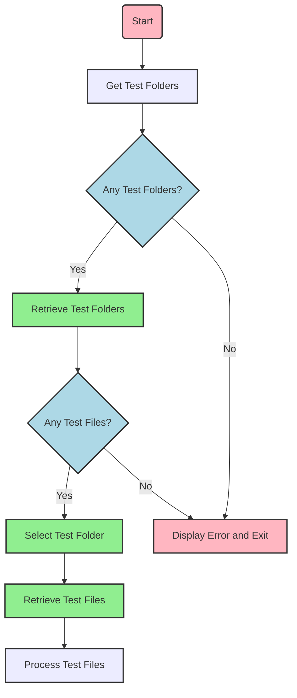
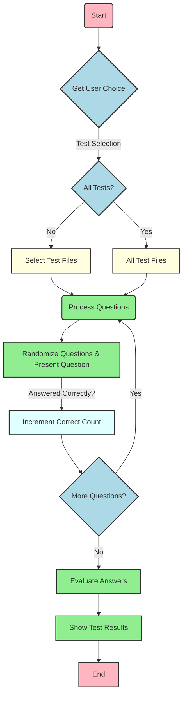
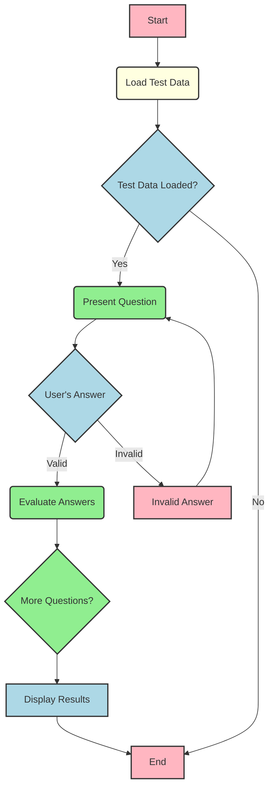

# Quiz CLI Documentation

## Objective

The chief objective of this project is to establish a structure and instrument for administering multiple-choice assessments. The project strives to simplify the procedure involved in designing, arranging, and implementing tests by utilizing TOML-formatted test documents.

### Components

1. **`test_folder_utils.py`**: This module provides utility functions for working with test folders. It includes functions for retrieving test folders in the current directory, retrieving test files within a specific test folder, and prompting the user to select a test folder.
    


2. **`text_executor.py`**: This module contains additional core functionality for conducting multiple-choice tests. It includes functions for clearing the screen, getting user choices for tests and test folders, conducting tests, and displaying test results.
    


3. The **`main.py`** script utilizes the functions from **`test_utils.py`**, **`test_folder_utils.py`**, and **`text_executor.py`** to facilitate the selection and execution of multiple-choice tests. It interacts with the user, presents questions, collects answers, evaluates them, and displays the test results.
    

    

Here is the directory structure for the project:
```
project/
├── main.py
├── test_utils.py
├── test_folder_utils.py
├── <test-theme-1>/
│   ├── test-1.toml
│   ├── test-2.toml
│   └── ...
├── <test-theme-2>/
│   ├── test-1.toml
│   ├── test-2.toml
│   └── ...
├── <test-theme-3>/
│   ├── test-1.toml
│   ├── test-2.toml
│   └── ...
└── ...
```

The **`*.toml`** files represent individual tests in TOML (Tom's Obvious, Minimal Language) format. Each test file contains a set of multiple-choice questions along with their choices and correct answers. The **`main.py`** script loads these test files, selects questions randomly, presents them to the user, collects their answers, and evaluates them against the correct answers.

TOML file format:
```toml
[[questions]]
question = "<Question 1>"
choices = [
  "Choice 1",
  "Choice 2",
  "Choice 3",
  "Choice 4"
]
# Answer: Choice X (X)
[[questions]]
question =  "<Question 2>"
choices = [
  "Choice 1",
  "Choice 2",
  "Choice 3",
  "Choice 4",
  "Choice 5"
]
# Answer: Choice X (X)
...
[correct_answers]
correct_answers = [X1, X2, ...]
```

## **Benefits and Features**

1. Flexibility: Users can create and customize multiple-choice tests by editing TOML-formatted test files. They can add new questions, modify choices, and define correct answers.
2. Organization: The project supports the organization of tests into test folders, allowing users to categorize and manage their tests effectively.
3. Randomization: The script randomly selects questions from the available test files, providing variation and preventing predictable patterns in the tests.
4. Interactivity: The project engages users by presenting questions one by one and collecting their answers interactively.
5. Evaluation: The project automatically evaluates the user's answers against the correct answers, providing feedback on the number of correct responses.
